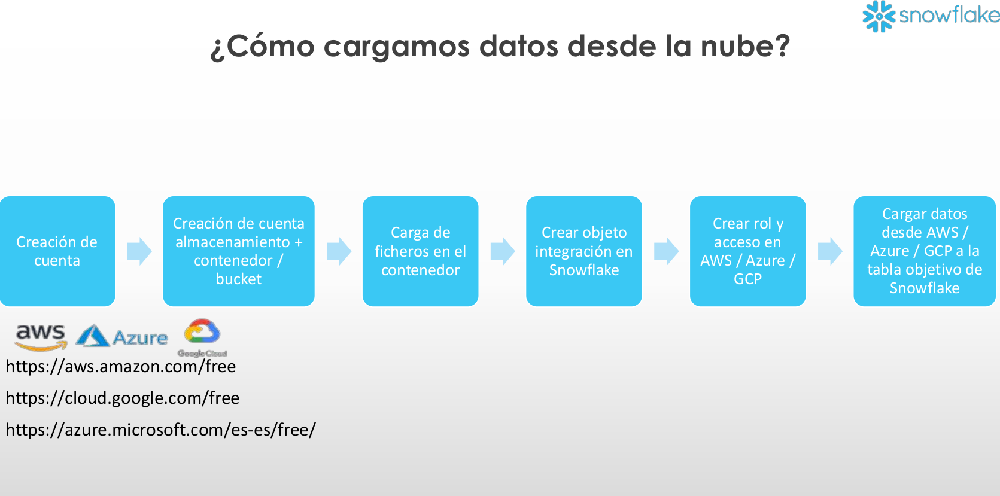
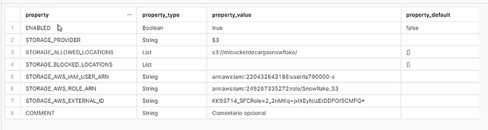
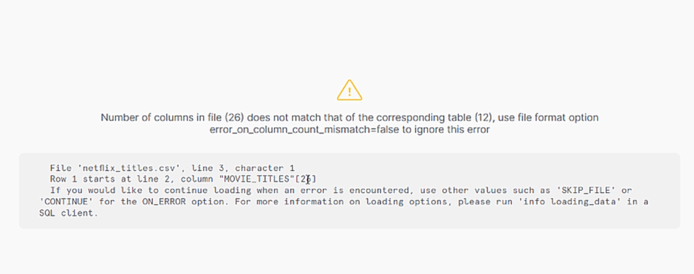
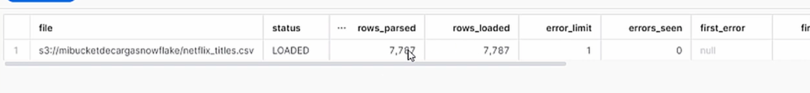
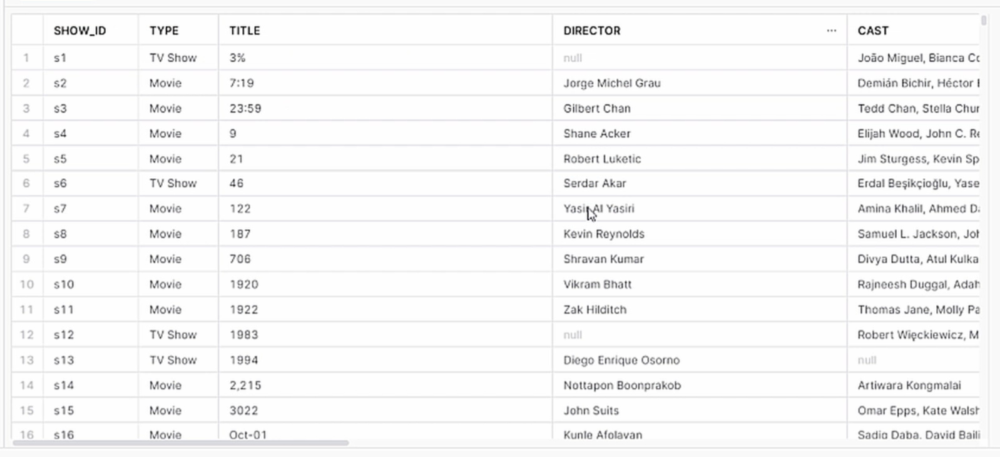

# 4-Carga-de-datos-desde-cloud
1. [Crear objeto de integración en Snowflake](schema1)
2. [Cargar datos a la tabla objetivo de Snowflake](#schema2)


<hr>

<a name="schema1"></a>

## 1. Crear objeto de integración en Snowflake



- Crear objeto integración
```
create or replace storage integration s3_int
  TYPE = EXTERNAL_STAGE
  STORAGE_PROVIDER = S3
  ENABLED = TRUE 
  STORAGE_AWS_ROLE_ARN = ''//copiar arn del role
  STORAGE_ALLOWED_LOCATIONS = ('s3://<your-bucket-name>/<your-path>/', 's3://<your-bucket-name>/<your-path>/')
   COMMENT = 'Comentario opcional' 
```

- Verificar propiedades para coger el external_id y actualizarlo en S3
```
DESC integration s3_int;
```


<hr>

<a name="schema2"></a>

## 2. Cargar datos a la tabla objetivo de Snowflake

- Crear tabla objetivo
```sql
CREATE OR REPLACE TABLE PRIMERABBDD.PRIMERESQUEMA.movie_titles (
  show_id STRING,
  type STRING,
  title STRING,
  director STRING,
  cast STRING,
  country STRING,
  date_added STRING,
  release_year STRING,
  rating STRING,
  duration STRING,
  listed_in STRING,
  description STRING )
```
- Crear objeto formato de fichero
```sql
CREATE OR REPLACE file format MANAGE_DB.file_formats.csv_fileformat
    type = csv
    field_delimiter = ','
    skip_header = 1
    null_if = ('NULL','null')
    empty_field_as_null = TRUE;
```
- Crear stage con el objeto de integración y el objeto de formato
```sql
CREATE OR REPLACE stage MANAGE_DB.external_stages.csv_aws
    URL = 's3://<your-bucket-name>/<your-path>/'
    STORAGE_INTEGRATION = s3_int
    FILE_FORMAT = MANAGE_DB.file_formats.csv_fileformat
```

- Usar comando COPY para cargar en la tabla objetivo  
```sql
COPY INTO PRIMERABBDD.PRIMERESQUEMA.movie_titles
    FROM @MANAGE_DB.external_stages.csv_aws
```

Porque hay frases con `,` y esas no las queremos dividir.


    
- Crear de nuevo el objeto formato de fichero para indicar que hay campos que tienen el caracter " y si encuentra comas no las tenga en cuenta.
```sql
CREATE OR REPLACE file format MANAGE_DB.file_formats.csv_fileformat
    type = csv
    field_delimiter = ','
    skip_header = 1
    null_if = ('NULL','null')
    empty_field_as_null = TRUE    
    FIELD_OPTIONALLY_ENCLOSED_BY = '"'    
    
    
SELECT * FROM PRIMERABBDD.PRIMERESQUEMA.movie_titles
```

